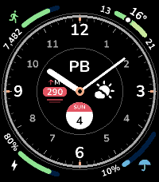
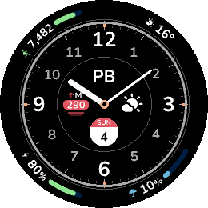

# Ultra

An analog watchface for Pebble with eight complications you choose yourself. Four gauges curve around the corners, four subdials sit inside the dial, and every one is yours to swap.

- **Eight slots, your pick.** Steps, distance, calories, active minutes, sleep, heart rate, battery, the date in eight formats, week and year progress, temperature, rain, humidity, wind, air quality and UV index (as sections or a gauge), elevation, sunrise and sunset, moon phase, digital time, other time zones, .beat time, current weather, your own text, or a value from any JSON API.
- **Five color schemes.** Black, White, two monochromes, or Accent: any background and accent from the watch's 64 colors.
- **Six rings** Default, Minimal, Sport, Chronograph, Roman or Tachymeter ring.
- **Six hands.** Line, Bar, Outline, Pointer, Sword or Dauphine hands, each in its own color. Or none, with the time in a complication.
- **Live preview.** The settings page draws the face as you change it.
- **No account, no API key.** Weather and air quality come from [Open-Meteo](https://open-meteo.com), refreshed every 30 minutes, or as often as you set. The Location complication names your city with [BigDataCloud](https://www.bigdatacloud.com), asked only while it is on the face.

## Screenshots
### Pebble Time 2



### Pebble Time Round 2



## Store
[Rebble App Store](https://apps.rebble.io/en_US/application/6abf59c037b3780009304810)

[Pebble App Store](https://apps.repebble.com/6abf59c037b3780009304810)

### Settings
| Setting | What it does |
| --- | --- |
| Corners | The four arc gauges outside the dial: top left, top right, bottom left, bottom right. |
| Center | The four subdials inside the dial: top, left, right, bottom. |
| Time zone | Pick **Time zone** in any slot, then its zone under it. Every slot showing one has its own. |
| Date | Pick **Date** in any slot, then its format under it: Calendar (yesterday, today and tomorrow in a corner, a tear-off page in a subdial), Weekday and day (TUE 6), Month and day (OCT 6), Full date (TUE over 6 OCTOBER in a corner, TUE 6 OCT in a subdial), Numeric (6/10/2026; month first with °F and miles), Week number (ISO, weeks start on Monday), Day of year or Year. Every slot showing one has its own. |
| Text | Pick **Text** in any slot to show your own label: up to 12 characters in a corner, 4 in a subdial. |
| Custom complications | Show a value from any JSON API. Create up to 8, then pick them in any corner or subdial. See below. |
| Color scheme | Black, White, White on black, Black on white, or Accent. Accent adds a background and an accent color picker. |
| Ring | Default, Minimal (ticks only, no numerals), Sport (a white band of minute numerals over an accent ring) Chronograph (the white band alone, black on white, hours 1 to 12), Roman (Default with its hours in Roman numerals, turned along the dial), Tachymeter (seconds ticks around a colored band of 10 to 60, a dot between each) or Compass (a compass bezel: N, E, S, W and the degrees between, 30 to 330, on a band; it is fixed and does not turn to north). Minimal, Sport, Chronograph, Tachymeter and Compass leave a larger center: the subdials grow to fill it and the hands run longer. Sport, Chronograph, Tachymeter and Compass take a band color; ticks and numerals turn black or white to stay readable on it. Tachymeter's band follows the seconds color until it has its own. Picking a color scheme resets it. |
| Hands | Line, Bar, Outline, Pointer, Sword or Dauphine for the hour and minute hands, or None to hide them (the seconds hand has its own switch), and a color each for the hour, minute and seconds hands. The seconds color is also the 12, 3, 6 and 9 notches'. Picking a color scheme resets the colors; picking an accent resets the seconds color. |
| Weather | **Refresh every** 15 or 30 minutes, 1, 2 or 3 hours. **Location**: the phone's, or search a city and pick it; weather, air quality, sun times and the Location complication are then that city's, and the phone's position is not asked. |
| Units | °C, km and km/h, or °F, miles and mph. |
| Daily step goal | 1,000 to 30,000 steps. Fills the steps, distance and calories gauges. |
| Seconds hand | Off by default. Uses more battery. It rests during Quiet Time and at 20% battery or less. |
| Sweeping seconds | With the seconds hand on: it glides instead of ticking, 8 steps a second. Drains the battery much faster. On the round watch only with Line or no hands. |
| Shake to hide hands | Off by default. Shake the watch twice to hide the hands for 5 seconds, so the center complications show whole. |
| Battery saver | Off by default. After an hour with no steps and no pulse, the face sleeps: it redraws once an hour, the seconds hand stops, and weather and custom complications refresh once an hour. The hands can be up to an hour behind until a step, a pulse or a shake wakes it. Never on the charger. |

Pick **None** to leave a slot empty.

### Custom complications
Each one reads a JSON API of your choice and shows a value from it.

| Field | What it does |
| --- | --- |
| URL | The endpoint. A plain `GET` that answers with JSON; an API key has to go in the URL. |
| Title | Its name in Settings and the slot pickers. |
| Header | Shown on the face with the value. Fixed text or a `{{path}}`; up to 4 characters once filled in. |
| Type | **Text** shows the value, like heart rate. **Bar** fills from min to max, like chance of rain. **Gauge** marks the value between min and max, like temperature. |
| Text | What to show. `{{path}}` is replaced with that value from the response, for example `{{results.data.points[1].value}} kW`. Up to 20 characters once filled in; in a corner a long one shrinks to fit. |
| Min, Max | Bar and gauge only. A number, or a `{{path}}` to one. The first `{{path}}` in Text is placed between them. |
| Refresh | Minutes between requests: 10 by default, 1 at least. |

The phone makes the requests, so the watch needs a connection to it. A value that can't be read shows as `--`.

Limits:
- Up to 8 custom complications.
- No request headers: the API has to work with a plain `GET`, any key in the URL.
- Numbers are rounded to 2 decimals. Text keeps only letters, digits, spaces and `% , - . / :`, so no `°` or accents.
- The bar and gauge use the accent color.
- A bar's value shrinks to leave half the corner to the bar.
- A gauge in a subdial hides its min and max when either is longer than 3 characters.
- When a refresh fails the last value stays; `--` only shows if the first request fails.
- Two complications on the same URL make two requests.

### Good to know
- Weather, rain, humidity, wind, air quality, UV, elevation, location and sunrise/sunset need location access for the Pebble app and a connection to your phone.
- Calories come as a total (active and resting, so it grows even with no steps) or active only.
- **Week** shows the week as seven sections, Monday first, lit up to today, with the weekday and the day. **Year progress** is a bar of how much of the year is gone.
- Each Time zone complication has its own zone, picked by abbreviation (PST, CET, IST). An abbreviation is a fixed offset: switch PST to PDT yourself when daylight saving starts or ends.
- The moon is drawn as seen from the northern hemisphere, from the mean lunar cycle: up to half a day off.
- Steps, distance, calories, active minutes, sleep and heart rate come from Pebble Health, so it has to be turned on. Heart rate needs a watch with a sensor.

## Development
```sh
npm install
npm run emulator   # build and install on the emulator
npm run phone      # build and install on your watch
npm run config     # open the settings page in the emulator
npm test
```
The settings page is [src/pkjs/config.html](src/pkjs/config.html). `npm run build` inlines it into `src/pkjs/page.js`, so edit the HTML, not the generated file.


## Changelog
See [CHANGELOG.md](CHANGELOG.md).

## Support
For issues, questions, or suggestions, please open an issue on GitHub.

## License
MIT License - feel free to modify and share!