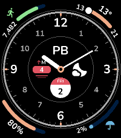
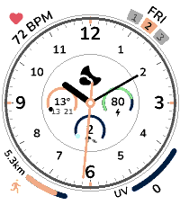
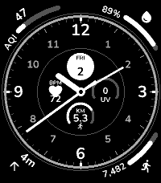
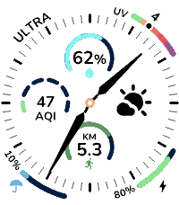
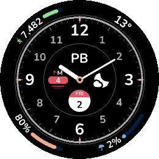
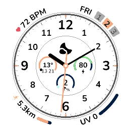
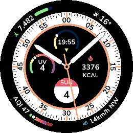
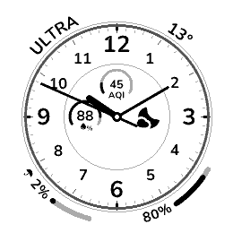

# Ultra

An analog watchface for Pebble with eight complications you choose yourself. Four gauges curve around the corners, four subdials sit inside the dial, and every one is yours to swap.

- **Eight slots, your pick.** Steps, distance, heart rate, battery, calendar, temperature, rain, humidity, air quality, UV index, elevation, current weather, or your own text.
- **Five color schemes.** Black, White, two monochromes, or Accent: any background and accent from the watch's 64 colors.
- **Live preview.** The settings page draws the face as you change it.
- **No account, no API key.** Weather and air quality come from [Open-Meteo](https://open-meteo.com), refreshed every 30 minutes.

## Screenshots
### Pebble Time 2





### Pebble Time Round 2





## Store
[Rebble App Store](https://apps.rebble.io/en_US/application/)
[Pebble App Store](https://apps.repebble.com/)

### Settings
| Setting | What it does |
| --- | --- |
| Corners | The four arc gauges outside the dial: top left, top right, bottom left, bottom right. |
| Center | The four subdials inside the dial: top, left, right, bottom. |
| Text | Pick **Text** in any slot to show your own label: up to 12 characters in a corner, 4 in a subdial. |
| Color scheme | Black, White, White on black, Black on white, or Accent. Accent adds a background and an accent color picker. |
| Units | °C and km, or °F and miles. |
| Daily step goal | 1,000 to 30,000 steps. Fills the steps and distance gauges. |
| Seconds hand | Off by default. Uses more battery. |

Pick **None** to leave a slot empty.

### Good to know
- Weather, rain, humidity, air quality, UV and elevation need location access for the Pebble app and a connection to your phone.
- Steps, distance and heart rate come from Pebble Health, so it has to be turned on. Heart rate needs a watch with a sensor.

## Development
```sh
npm install
npm run emulator   # build and install on the emulator
npm run phone      # build and install on your watch
npm run config     # open the settings page in the emulator
npm test
```
The settings page is [src/pkjs/config.html](src/pkjs/config.html). `npm run build` inlines it into `src/pkjs/page.js`, so edit the HTML, not the generated file.


## Support
For issues, questions, or suggestions, please open an issue on GitHub.

## License
MIT License - feel free to modify and share!